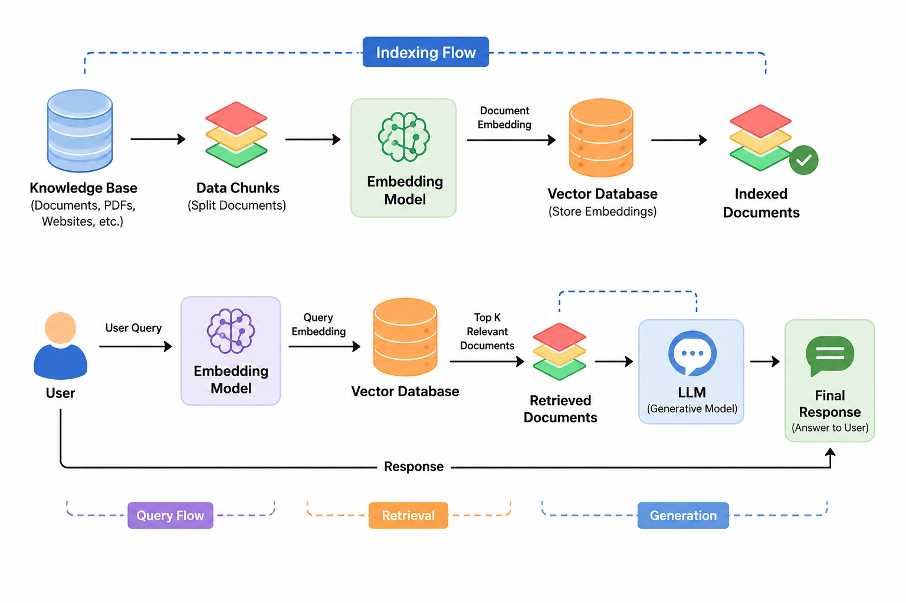

# RAG - Retrieval-Augmented Generation

This is an AI Framework that improves LLM responses by fetching relevant information from the provided custom data (such as PDFs, videos, PPTs, etc.)

**Retrieval** - It performs systematic search across the provided custom data (stored in vector database) to find the most relevant information for the query.

**Augmentation** - The system dynamically combines the user's query and the retrieved documents into a single, context rich prompt.

**Generation** - The LLM uses this provided context to construct an accurate, highly tailored final response

## Why do we need RAG?

RAG helps you to be more personalized and you can chat with up-to-date data, making it a cost-effective solution for you.

## Advantages of RAG

- Reduces Hallucinations
- Keeps Knowledge Up-to-date
- Cost Effective
- Maintains Data Privecy

## How does RAG work

There are mainly two steps in RAG process:

1.  _Indexing_ - In this step, the data is converted into vector embeddings and stored in a vector database. This allows for efficient retrieval of relevant information based on the user's query.

2.  _Querying_ - In this step, when a user submits a query, the system retrieves relevant documents from the vector database, combines them with the user's query to create a context-rich prompt, and then generates a response using a language model.

Here is a simple diagram to illustrate the RAG process:

 

**Knowledge Base** - The knowledge base is a collection of documents that are used to provide context for the language model. It can include various types of data such as PDFs, videos, presentations, and more. The knowledge base is indexed and stored in a vector database for efficient retrieval.

**Data Chunks** - Data chunks are smaller segments of the documents in the knowledge base. They are created to facilitate more efficient retrieval and to provide more focused context for the language model. Each chunk is converted into vector embedding and stored in the vector database.

**Embeddings** - Embeddings are numerical representations of the data chunks that capture their semantic meaning. They are generated using machine learning models and are used to perform similarity searches in the vector database.

**Vector Database** - A vector database is a specialized database that stores vector embeddings and allows for efficient similarity searches. It enables the retrieval of relevant data chunks based on their semantic similarity to the user's query.

**Retrieved Documents** - Retrieved documents are the data chunks that are fetched from the vector database in response to the user's query. These documents provide context for the language model to generate a more accurate and relevant response.

### My Implementation of RAG

I have created a two files, `indexing.js` and `query.js` which are responsible for indexing the data and querying it, respectively.

You can check the required packages in the `package.json` file and install them using `npm install` command.

For this implementation, I use the Gemini LLM to generate responses, Gemini Embeddings to create vector embeddings for the data chunks, and Qdrant as the vector database for storing and retrieving those embeddings.
